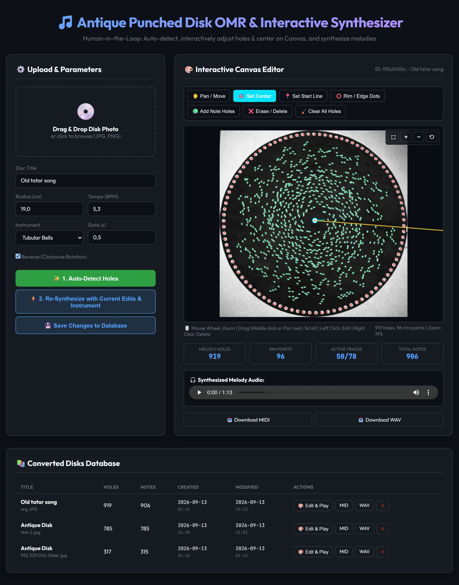

# Antique Punched Disk OMR & Music Synthesizer

An Optical Music Recognition (OMR) and audio synthesis application for digitizing antique punched metal music-box disks from photographs.

The application detects punched holes, estimates the disk geometry, converts holes into musical tracks, and generates MIDI and WAV output. It also provides a Human-in-the-Loop editor so a user can correct the center, disk edge, start position, and detected holes before regenerating the melody.

## Application Preview



---

## 🚀 Key Features

- **Geometric stabilization**: Compensates for uneven disks, eccentricity, and perspective using harmonic boundary modeling and elliptical correction.
- **Adaptive Radial Density Comb Alignment**: Identifies empirical star-wheel track ridges via radial density peaks to eliminate octave and semitone quantization errors.
- **Hole Detection & Polar Transformation**: Automatically locates the arbor center with contour moments, extracts punch centroids, and converts to polar coordinates $(\theta, r)$.
- **78-Track Discretization**: Accurately registers holes into 78 physical comb tracks across 3 musical registers.
- **Human-in-the-Loop Canvas Editor**:
  - Set or move the disk center.
  - Set a start line that defines the beginning of playback.
  - Add and remove melody holes manually.
  - Add reference points along the disk rim.
  - Zoom, pan, and use fullscreen mode for high-resolution images.
  - Save edits and metadata to the JSON database without regenerating audio.
  - Regenerate MIDI and WAV using the current edits and selected instrument.
- **Radial volume shaping**: Inner tracks are quieter and outer tracks are louder by default, matching the experimental behavior of the original thesis implementation.
- **Audio Synthesis**:
  - Direct MIDI generation (`.mid`) via `MIDIFile` with customizable tempo and reverse playback.
  - SoundFont rendering via `FluidSynth` when a SoundFont is available.
  - Built-in resonant comb synthesizer fallback for WAV output when FluidSynth or a SoundFont is unavailable.
  - Optional `.mp3` export.
- **Lightweight Full-Stack Architecture**:
  - **Backend**: Python 3.12+ with Flask and an atomic JSON file database.
  - **Frontend**: Server-rendered HTML/CSS/JavaScript dashboard with drag-and-drop upload, Canvas editing, audio playback, downloads, and processing history.

📖 **For the complete mathematical formulation and mechanical physics analysis, see [docs/DEFORMATION_AND_CALIBRATION.md](docs/DEFORMATION_AND_CALIBRATION.md).**

---

## 📁 Project Structure

```
omr_disk_app/
├── app.py                     # Main application entry point & API routes
├── batch_process.py           # Optional batch processing script for data/uploads
├── requirements.txt           # Python dependencies
├── docs/
│   └── DEFORMATION_AND_CALIBRATION.md
├── core/
│   ├── cv/
│   │   ├── preprocessor.py    # Full-frame filtering, contour detection, center finding
│   │   ├── stabilizer.py      # Elliptical and harmonic deformation correction
│   │   ├── quantizer.py       # Adaptive radial calibration and 78-track binning
│   │   └── visualizer.py      # Visual debug overlay generator
│   ├── audio/
│   │   ├── midi_builder.py    # MIDI event construction (angles to time)
│   │   └── synthesizer.py     # FluidSynth SoundFont & acoustic fallback synthesizer
│   ├── storage/
│   │   └── json_db.py         # Atomic JSON document database
│   └── pipeline.py            # Complete processing and interactive recompute pipeline
├── data/
│   ├── db.json                # Local JSON metadata database
│   ├── uploads/               # Uploaded disk photos
│   ├── outputs/               # Generated MIDI, WAV, MP3, and preview files
│   └── soundfonts/            # Optional SoundFont files (.sf2)
└── templates/
    └── index.html             # Clean web dashboard
```

---

## ⚡ Installation & Setup

### 1. Requirements
- **Python 3.10+**; Python 3.12 is the development target.
- Optional: **FluidSynth** and **FFmpeg** for SoundFont rendering and MP3 export.

### 2. Install Python Packages
```bash
cd omr_disk_app
pip install -r requirements.txt
```

### 3. Launch the Application
```bash
python app.py
```
Open **[http://127.0.0.1:5000](http://127.0.0.1:5000)** in your browser.

### Optional SoundFont setup

Place a `.sf2` file in `data/soundfonts/` and pass its name through the pipeline when using a custom integration. Without a SoundFont, the application still generates WAV files using its built-in fallback synthesizer.

## User Workflow

1. Upload a disk image and choose the physical radius and playback settings.
2. Click **Auto-Detect Holes**.
3. Use the Canvas editor to correct the center, start line, rim reference points, and melody holes.
4. Click **Save Changes to Database** to persist edits without changing the existing audio files.
5. Click **Re-Synthesize with Current Edits & Instrument** to generate updated MIDI and WAV files.
6. Use the history table to reopen a record, play its audio, or download its files.

The editor supports mouse-wheel zoom, pan mode, middle-button dragging, right-click deletion, and fullscreen mode.

## API Endpoints

| Method | Endpoint | Purpose |
|---|---|---|
| `GET` | `/` | Render the application UI |
| `POST` | `/api/process` | Upload and process a new disk image |
| `POST` | `/api/recompute` | Rebuild MIDI/WAV from edited Canvas coordinates |
| `POST` | `/api/save-edits` | Save title, parameters, and edited coordinates |
| `POST` | `/api/regenerate` | Regenerate an existing record with selected settings |
| `GET` | `/api/disk/<id>` | Read a saved disk record |
| `DELETE` | `/api/disk/<id>` | Delete a saved record |

---

## ⚙️ Calibration Parameters

| Parameter | Default | Description |
|---|---|---|
| `disk_radius_cm` | `19.0` | Physical radius of the disk in centimeters |
| `tempo_bpm` | `5.3` | Playback tempo in BPM (music boxes rotate slowly) |
| `instrument_program` | `11` | General MIDI program (`11` = Music Box) |
| `note_duration` | `0.5` | Note duration in seconds |
| `reverse_direction` | `True` | Clockwise disk rotation ($t = 2\pi - \theta$) |

## Data and Git

Runtime data is intentionally excluded from Git by `.gitignore`:

- Uploaded images in `data/uploads/`.
- Generated media and previews in `data/outputs/`.
- Local metadata in `data/db.json`.
- Python caches, virtual environments, IDE files, and temporary files.

Empty runtime directories are preserved with `.gitkeep` files. Keep personal disk images and SoundFont files out of the repository unless you explicitly intend to publish them and have permission to do so.

## Current Limitations

- Detection quality depends on image contrast, lighting, disk visibility, and camera perspective.
- The default 78-track pitch map is a historical approximation and may need calibration for a specific music-box model.
- The JSON database is intended for a local MVP, not concurrent production deployments.
- MP3 generation requires a working FFmpeg installation.
