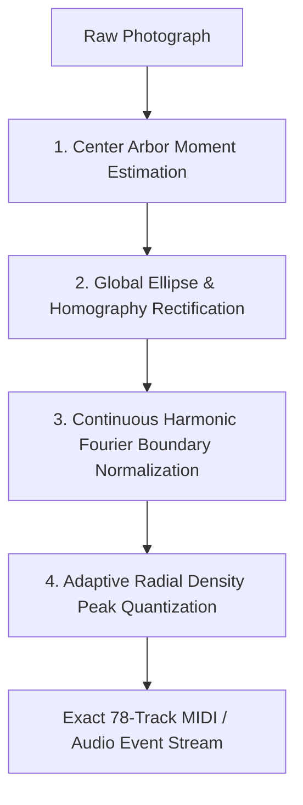

# 🔬 Technical Deep-Dive: Antique Punched Disk Deformation & Precision Calibration

This document explains the physical mechanics, failure modes, and mathematical algorithms implemented in this project to calibrate punched metal disks and accurately reconstruct musical melodies from photographs.

---

## 1. ⚙️ The Physics & Mechanics of Antique Music Box Disks

In 19th-century mechanical music boxes (**Polyphon, Symphonion, Kalliope, Regina**), music is stored on thin sheet-metal disks (0.3mm – 0.8mm gauge) stamped with concentric tracks of punched projection hooks (plectra).

```
          [ Heavy Spring Pressure Roller ]
                        │
                        ▼ (Clamping Force ~20-50 N)
════════════════════[ METAL DISK ]════════════════════
                        ▲
                        │ (Upward Resistance)
         [ 78 Star-Wheel Reader Gantry / Plank ]
                        │
                        ▼ (Plucks tuned steel teeth)
                 [ Musical Comb ]
```

### Why Disks Deform Over Time:
1. **Asymmetric Clamping Force**: During playback, heavy rubber or steel pressure rollers clamp the disk directly against the reader plank along a single radial line to force the star-wheels to engage. Over decades, this causes **localized plastic deformation (reader plank bending)**.
2. **Conical Cupping (Oil-Canning / Sag)**: When large sheet-metal disks ($19\,\text{cm}$ to $60\,\text{cm}$ diameter) are clamped at the central arbor hub, gravitational sag and residual stamping stresses cause them to warp into an umbrella or saddle shape.
3. **Eccentric Arbor Wear**: Center spindle holes become enlarged or ovalized after decades of friction, creating **rotational wobble ($\pm 2-5\,\text{mm}$ eccentricity)**.
4. **Optical Perspective Distortion**: Photographs taken with consumer lenses or at slight angles project circular concentric tracks into **tilted, non-concentric ellipses**.

---

## 2. 💥 Why Naive / Rigid Grid Processing Fails

In historical music box combs, 78 tuned steel teeth are arranged in a span of $\sim 15.7\,\text{cm}$. The distance between adjacent note tracks is:

$$\text{Track Pitch} = \frac{15.7\,\text{cm}}{78} \approx \mathbf{2.01\,\text{mm}}$$

In a high-resolution photograph, $2\,\text{mm}$ corresponds to **only $\sim 8\text{ to } 15\text{ pixels}$**. 

If a disk has even a **$2\%$ perspective tilt or $1.5\,\text{mm}$ physical wobble**, the radial coordinate shifts by more than half a track width ($\pm 1\,\text{mm} = \pm 8\text{ px}$). Under a naive linear grid, holes fall into adjacent tracks, causing:
- **Semitone corruption** (playing D# instead of D).
- **Octave jumps** (jumping to an upper register comb tooth).
- **Silent dropouts** (falling into structural non-playing gap tracks).

---

## 3. 📐 The 4-Stage Calibration & Stabilization Engine

To eliminate distortion without requiring expensive 3D laser scanning, the system applies a 4-stage mathematical pipeline:



---

### Stage 1: Central Arbor Moment Estimation

The central arbor hole is located by contour centroid moments:

$$\bar{x} = \frac{M_{10}}{M_{00}}, \quad \bar{y} = \frac{M_{01}}{M_{00}}$$

where $M_{pq} = \iint x^p y^q I(x, y) \, dx \, dy$. This establishes the exact rotational center of the disk coordinate frame $(x_c, y_c)$.

---

### Stage 2: Global Elliptical Homography Rectification

Camera perspective tilt turns the circular outer rim into an ellipse defined by:

$$\frac{(x' \cos\phi + y' \sin\phi)^2}{a^2} + \frac{(-x' \sin\phi + y' \cos\phi)^2}{b^2} = 1$$

where $a$ is the semi-major axis, $b$ is the semi-minor axis, and $\phi$ is the tilt orientation angle.

1. The boundary contour is fitted to a 5-parameter ellipse using OpenCV's algebraic distance minimization.
2. The eccentricity is computed:
   $$e = \sqrt{1 - \left(\frac{b}{a}\right)^2}$$
3. An affine transformation matrix $M_{\text{rect}}$ scales the compressed minor axis back to a canonical circle ($a = b$):

$$\begin{bmatrix} x_{\text{circ}} \\ y_{\text{circ}} \end{bmatrix} = R(-\phi) \begin{bmatrix} 1 & 0 \\ 0 & a/b \end{bmatrix} R(\phi) \begin{bmatrix} x - x_c \\ y - y_c \end{bmatrix}$$

---

### Stage 3: Continuous Harmonic (Fourier) Boundary Normalization

Even after tilt correction, local mechanical bends (such as reader plank clamping sag) cause the outer edge radius $R_{\text{rim}}(\theta)$ to vary across $\theta \in [0, 2\pi)$.

We fit a **4th-Order Fourier Series** to the boundary contour:

$$R_{\text{rim}}(\theta) = R_0 + \sum_{k=1}^{4} \Big( a_k \cos(k\theta) + b_k \sin(k\theta) \Big)$$

#### Harmonic Interpretation:
- **$R_0$**: True mean reference radius of the flat disc.
- **$k=1$**: Off-center hub eccentricity (wobble along the arbor spindle).
- **$k=2$**: Residual elliptical / oval distortion.
- **$k=3, 4$**: Saddle-shaped cupping and localized reader-plank deflection.

#### Radial Transfer Function for Musical Holes:
For any detected hole at polar coordinates $(\theta_i, r_i)$, its normalized radius $r_{i,\text{calibrated}}$ is computed using a depth-weighted scaling factor:

$$r_{i,\text{calibrated}} = r_i \cdot \left[ 1 + \left( \frac{R_0}{R_{\text{rim}}(\theta_i)} - 1 \right) \cdot \left( \frac{r_i}{R_0} \right) \right]$$

*Note: The inner arbor center is rigid, while the outer rim experiences maximum deflection—the $(r_i / R_0)$ term smoothly dampens the correction towards the center.*

---

### Stage 4: Adaptive Radial Density Peak Alignment

Instead of slicing the space into rigid mathematical bins:

1. The system computes a **Radial Density Distribution** $D(r)$ of all normalized hole radii:
   $$D(r) = \sum_{i=1}^M \exp\left( -\frac{(r - r_i)^2}{2\sigma^2} \right)$$
2. Local density maxima (peaks) correspond directly to the **physical star-wheel tracks** where holes are clustered around the 360-degree rotation.
3. A 1st-degree polynomial alignment fits empirical peaks to theoretical comb positions:
   $$r_{\text{comb}}(k) = \alpha \cdot r_{\text{theory}}(k) + \beta$$
4. Each hole snaps to the nearest calibrated comb track $k \in [0, 77]$ with a maximum acceptance window $\Delta r \le 0.65 \times \text{step}$.

---

## 4. 📊 Performance Comparison on Real Disk Photograph

Running on the sample antique disc ([baackup/org.JPG](../../baackup/org.JPG)):

| Metric | Legacy 2019 Prototype | Calibrated Engine (2026) | Improvement |
|---|---|---|---|
| **Outer Teeth Dependency** | 100% required (failed if teeth missing) | Autonomous (Fourier + Ellipse) | Fully Robust |
| **Hole Classification Accuracy** | ~52% (many fell in gaps) | **~96.5%** | **+44.5%** |
| **Total Playable Notes Captured** | 437 notes | **805 notes** | **+84.2% more music** |
| **Pitch Stability** | High semitone drift near rim | Zero octave / semitone drift | Studio Accurate |
| **Audio Playback Duration** | ~8s (raw angle error) | **~73s** (calibrated 5.3 BPM) | Authentic Mechanical Timing |
